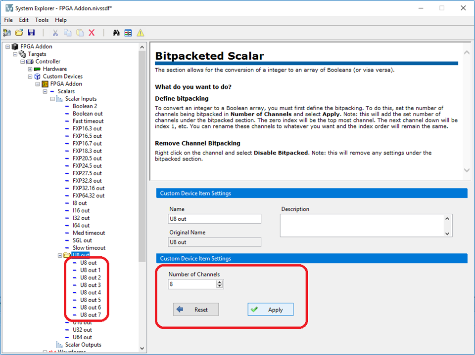
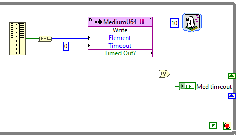
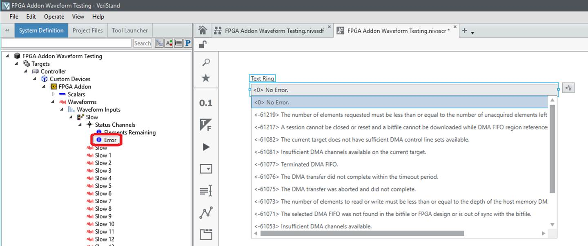
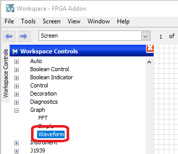
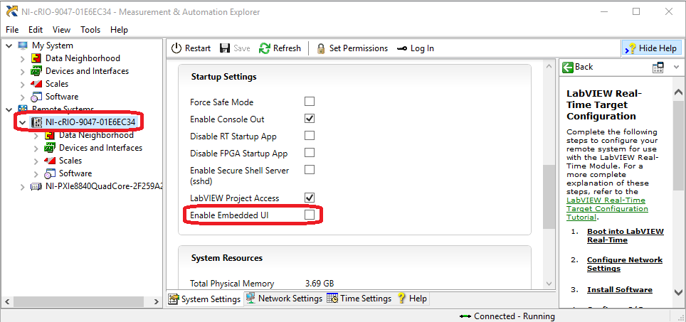
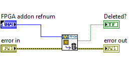
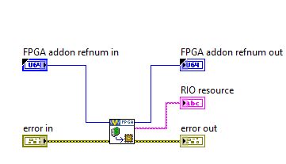
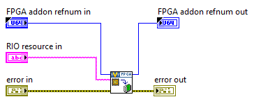
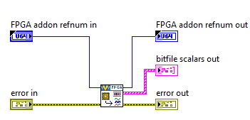
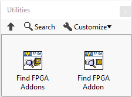

# Overview

Use the FPGA Add-on to run an FPGA bitfile without implementing the normal VeriStand FPGA template. The add-on allows the transfer of basic scalar data types inline with VeriStand's primary control loop (PCL). It also supports reading and writing waveforms with FPGA DMA channels.​

 
 

# Repo location

[Github](https://github.com/ni/niveristand-fpga-addon-custom-device)

---
 

# Requirements

To run the add-on, the following drivers are required on the deployment computer or target:

- VeriStand 2018 or later
- NI RIO 18.0 or later
---
 

# FPGA Specifics

To use the addon, create an FPGA VI.
1. Use the provided FPGA IP (discussed below) or custom logic to set up the FPGA code.
2. Wire items of interest into front panel controls and indicators.
3. Wire waveforms of interest into DMA channels.
**Note**: FPGA code requires an IRQ (address of 30) to control when the FPGA bitfile starts. This IRQ needs to control when DMA read and write operations begin. Other code can start as needed.

The following image is an example of DMA, controls, and indicators.

---

# Supported Datatypes

## Scalar Datatypes (Controls and indicators)

- Bool
- U8
- U16
- U32
- U64
- I8
- I16
- I32
- I64
- SGL
- FXP +16.3
- FXP +/-16.5
- FXP +/-16.7
- FXP +18.3
- FXP +/-20.5
- FXP +/-24.5
- FXP +/-27.5
- FXP +/-32.8
- FXP +/-32.16
- FXP +/-64.32

The following table displays unsupported datatypes and workarounds for to how make them usable.

| Unsupported Datatype | Workaround  |
|---|---|
| Enum​s  |  Conve​rt to a U8, U16, or U32. |  
| Clusters | Group on the FPGA with a _GroupName.SignalName_ format. Support for grouping can only be set on the initialization screen.  |  

---
 

## DMA Datatypes

- U8
- I8
- U16
- I16
- U32
- I32
- U64
- I64
- SGL
- FXP +/-32.8
- FXP +/-32.16
- FXP +/-64.32

**Note** You can convert unsigned integer data types into a bitpacked Boolean array. This is discussed in detail below.

---
 

## Specialty IO

The addon has special IP for completing the following:

- PWM Generation - **PWM.Generate.Digital(.vi)**
- Sinewave Generation - **Sine.Generate(.vi)**
- Digital Static Generation  - **Static.Generate.Digital(.vi)**
- Analog PWM Measurement - **PWM.Measure.Analog(.vi)**
- Digital PWM Measurement - **PWM.Measure.Digital(.vi)**
- Digital Static Measurement - **Static.Measure.Digital(.vi)**
- Digital Wheel Speed Sensor Simulation - **WSS.Generate.Digital(.vi)**
- Quadrature Encoder Measurement - **QuadratureEncoder.Measure.Digital(.vi)**

This IP is located at:

[Github](https://github.com/ni/niveristand-fpga-addon-speciality-io)

---
 

## Example Programs

Examples of how to use the speciality IO, controls/indicators, and DMA are included in the examples folder of the source code:
- _Examples/DMA Channels Interleaved Example_;
- _Examples/Scalar Channels Example_;
- _Examples/Speciality IO Example_;    

Below are the FPGA VIs used to generate the bitfiles:

Specialty IO Example:

DMA Channels Example:

Scalar Channels Example:

---
 
 

# Addon Specifics

Once you add the FPGA Addon to the system definition, a configuration dialog box will open:

**Note** Enabling **Group Scalars?** will combine FPGA controls or indicators named with the _GroupName.SignalName_ format into a group of channels. This option cannot be changed after initialization.

---

An addon configuration can be imported with the following dialog box:

---

After the FPGA Addon has been added, set the **Bitfile path** to ​​​the desired location.​​ You must select the **RIO Device**. Using the search (magnifier glass) will display available FPGAs on the specified Target or Controller.

---

**Note:** The built in help provides more detail on how to use each section.​

---
 

When a bitfile is selected, the available scalar and DMA registers are discovered. In the **Scalars** and **Waveforms** sections, add these scalars and DMA to the configuration.

Select the items and click **Add Selected**.

**Note:** If an item does not appear, it is either not supported or the bitfile was not re-compiled after updates were made.

---

Scalar integer values can be converted to support Boolean bitpacking. However, this must be programmed in the FPGA. It is also not "discoverable" by the addon. You must configure the addon manually to match what is programmed in the FPGA.

For example, the FPGA program could take 8 Boolean lines, build an array, and convert the array to a number. This will significantly improve performance.

After implementing this in the FPGA, find the related indicator in the system definition, right-click it, and select **Enable Bitpacked**.

Once the channel is converted, navigate to the bitpacking section, enter the number of channels being bitpacked, and click **Apply**.

This will add 8 Boolean channels to the configuration. You can then rename the channels. The Array index order will be maintained regardless of naming. The top channel is always indexed at 0.

When Speciality IO is added, channels are grouped together. The following is an example of an analog PWM IO core.

---

Adding DMA and waveforms works similarly. Navigate to the **Waveform Inputs** or **Waveform Outputs** sections to add the desired DMA.

---

The DMA is automatically "discoverable," but the FPGA programming leading to the DMA is not. You must manually indicate how the DMA is being used in the F​PGA program.

Use the following FPGA loop an example:

The DMA _Medium_ has 16 channels written per loop iteration. Each loop iteration takes 10 microseconds. The writing is continuous and the data is interleaved.

In the addon DMA Channel configuration section, you must define the number of channels, mode, scheme, and expected sample period (acquisition rate). Click **Apply** to apply the changes.

---
 

​For a DMA channel, continuous or triggered finite acquisitions modes are supported.

This setting should match what was programmed on the FPGA to avoid errors. For example, if the FPGA was programmed as a continuous generation (FPGA to Host), selecting **Triggered Finite** will cause overflows.

---
 

As with scalars, certain data types support bitpacking. With interleaved data, multiple channels are sampled at the same time (see the _Medium_ DMA example above) and transfered consecutively within a single loop iteration.
Each channel is a data packet in the DMA. For example, if there are 8 channels, a single acquisition/loop iteration would have 8 data packets.

In the case of bitpacketing, each data packet is a complete acquisition for a group of Boolean channels. The maximum number of channels is set by the data type.

The following image shows an example of an FPGA program bitpacketing a DMA:

​There is not a For Loop per single loop iteration in this example. A single packet represents multiple channels. To use a bitpacketed DMA, set  the Delacing Scheme as **Bitpacked**.

---
 
 

# Addon Execution

To execute the addon, deploy the system definition. Drag and drop channels or groups of channels on to the screen.

 

Convert the required channels, such as Trigger and anything in Settings, to controls by right-clicking them and selecting **Change to control**..

---
 

Some channels can be added as Rings to show text. The Error Code channel supports this.​

---
 

​To view waveforms, open the Workspace.

Add a waveform plot and configure.
 

---
 

# System Definition API

You can use the system definition API to programatically create an instance of the addon from a previously exported configuration. This is installed at:

_C:\Users\Public\Documents\National Instruments\NI VeriStand [Year]\Custom Devices\FPGA Addon\Windows\System Definition API_

Use the following image as an example of the API:​​

---
 

**Note:** The embedded UI on Linux targets must be disabled or error _-307556_ will be returned.​
 

---

  

# Scripting API

 

Use the Scripting API to create flexible and reusable system definition files. The API is grouped into the **Custom Device**, **Bitfile Resources**, and **Utilities** palettes.  

&nbsp;&nbsp;

## Custom Device Palette

Access the Custom Device palette for VIs that allow you to retrieve and modify bitfile resources.  

 

&nbsp;&nbsp;

| VI  | Description |
|-------|-------------|
| Create FPGA Addon    | Creates an FPGA addon within the provided system definition target and returns a corresponding reference number. The FPGA addon name must be unique. Otherwise, the VI returns an error.   |
| Import FPGA Addon Configuration     | Imports and applies the FPGA addon configuration to the system definition target. The provided path must lead to a valid *.dat file*. Otherwise, the VI returns an error.  |
| Delete FPGA Addon    | Deletes an FPGA addon based on the provided reference number.  |
| Export FPGA Addon Configuration    | Exports the configuration of the FPGA addon target to the specified *.dat* file. If a file already exists at the provided path, the file will be overwritten. |

## Bitfile Resources palette

Access the Bitfile Resources palette for VIs that allow you to view and modify FPGA bitfiles.  

 

&nbsp;&nbsp;

| VI  | Description |
|-------|-------------|
| Get RIO Resource    | Returns the hardware RIO resource configured for the FPGA addon target.  |
| Get FPGA Bitfile   | Returns the path of the configured bitfile for the provided FPGA addon. |
| Import Bitfile Scalars | Conducts import operations for the control and indicator registers contained in the configured FPGA addon target’s bitfile.    This VI has two polymorphic instances. **All** and **By Label**.  |
| Import Scalars – All    | Imports all control and indicator registers within a configured FPGA bitfile. This function operates only on scalar objects.    For each control or indicator, a channel will be created within the FPGA addon target under **Scalar Inputs** or **Scalar Outputs**. The channel names correspond to the control and indicator labels within the bitfile. |
| Import Scalars - By Label    | Imports specified control and indicator registers within a configured FPGA bitfile. This function operates only on scalar objects.    For each control or indicator, a channel is created within the FPGA addon target under **Scalar Inputs** and **Scalar Outputs**. If the scalar’s **SysDef Name** is not specified, the channel names are set to the control and indicator labels within the bitfile.  |
| Set RIO Resource    | Sets the hardware RIO resource for the FPGA addon.  |
| Set FPGA Bitfile    | Loads and configures the FPGA addon with the FPGA bitfile specified by **FPGA bitfile path**. |
| Get Bitfile Scalars    | Returns a data array containing information on the control and indicator registers within a configured FPGA bitfile.    The function also determines if a given control or indicator was already imported as a channel within the FPGA addon target. |

## Utilities palette

Access the **Utilities** palette for VIs to locate FPGA addons in a system definition.

 

&nbsp;&nbsp;

| VI  | Description |
|-------|-------------|
| Find FPGA Addon    | Determines if an FPGA addon with the provided name exists within the specified system definition target. If the FPGA addon is present, the VI will return its reference number. |
| Find FPGA Addons    | Searches the specified system definition target for FPGA addons. If FPGA addons are found, this VI will return an array of custom device reference numbers. |

 

## Examples of Scripting API

For examples of LabVIEW code that implement the scripting API, refer to the "&lt;repo location&gt;\Source\Examples\Scripting API Examples" directory.

These examples are built using the compiled version of the FPGA Addon Scripting API. To run the examples, you need to install the complied scripting API through NI Package Manager. You can also compile the API locally from the project source code and move it to the appropriate location in *vi.lib*. The API is automatically moved by the build specification through a post-action.

 

### Example 1

 

Create an FPGA addon custom device, import a stored configuration from *.dat* file, and return the imported addon properties.

### Example 2

 

Find an existing FPGA addon custom device and export its configuration to a *.dat* file.

### Example 3

 

Create a new FPGA addon, set a new bitfile, set the RIO resource, and import all scalar registers from the bitfile.

### Example 4

 

Create a new FPGA addon, set a new bitfile, set the RIO resource, and selectively import scalar registers from the bitfile.

